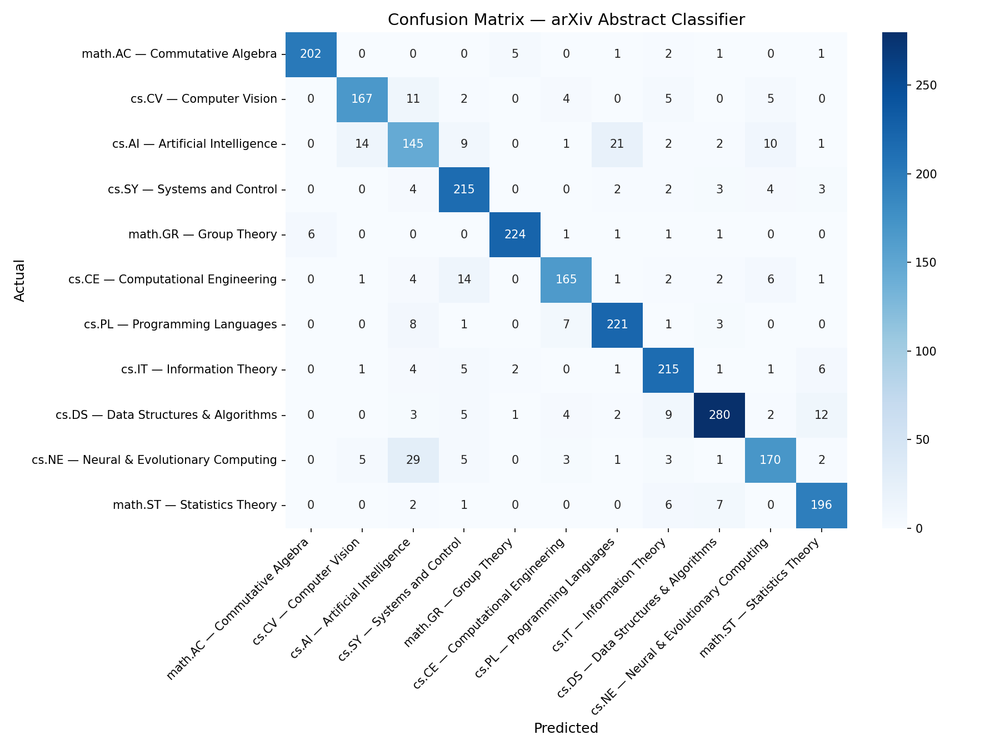
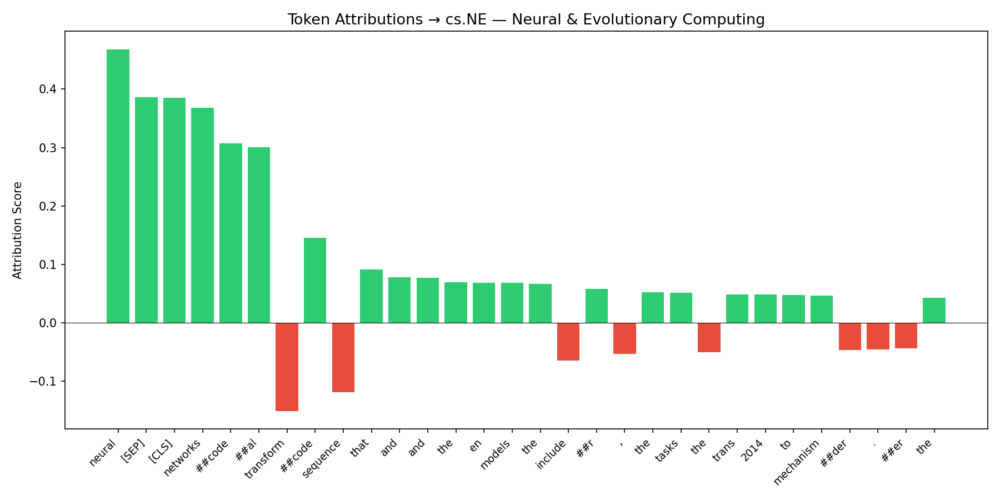
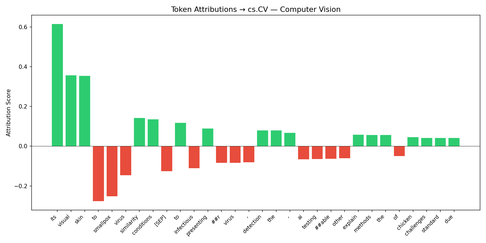
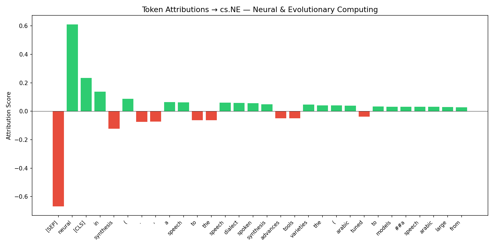

# arXiv Abstract Field Classifier

A fine-tuned DistilBERT model that classifies scientific paper abstracts into 11 arXiv fields. Trained on PSC GPU infrastructure, tracked with WandB, and evaluated with token-level explainability via Captum integrated gradients.

**88% test accuracy · 0.877 macro F1 · 11 classes · 28,388 training examples**

🚀 **[Live Demo — Streamlit App](https://huggingface.co/spaces/aeesh1/arxiv-abstract-classifier)**
🤗 **[Model on HuggingFace Hub](https://huggingface.co/aeesh1/arxiv-abstract-classifier)**
📊 **[WandB Training Run](https://wandb.ai/aeesh-aeesh/arxiv-abstract-classifier/runs/l5quax1q)**
💻 **[GitHub Repository](https://github.com/aeesh/abstract-classifier.git)**


---

## Overview

Given any scientific abstract, the model predicts which arXiv field it belongs to and explains which tokens drove the prediction. The model was fine-tuned from `distilbert-base-uncased` using weighted cross-entropy loss to handle class imbalance across the 11 categories. Explainability is implemented via Captum integrated gradients, showing which words in an abstract pushed the model toward or away from its prediction.

---

## The 11 Classes

| Label | arXiv Code | Field |
|-------|-----------|-------|
| 0 | math.AC | Commutative Algebra |
| 1 | cs.CV | Computer Vision |
| 2 | cs.AI | Artificial Intelligence |
| 3 | cs.SY | Systems and Control |
| 4 | math.GR | Group Theory |
| 5 | cs.CE | Computational Engineering |
| 6 | cs.PL | Programming Languages |
| 7 | cs.IT | Information Theory |
| 8 | cs.DS | Data Structures & Algorithms |
| 9 | cs.NE | Neural & Evolutionary Computing |
| 10 | math.ST | Statistics Theory |

---

## Results

### Test Set Performance

| Metric | Score |
|--------|-------|
| Accuracy | 88.0% |
| Macro F1 | 0.877 |
| Weighted F1 | 0.880 |

### Per-Class F1 Scores

| Class | F1 | Notes |
|-------|----|-------|
| math.AC — Commutative Algebra | 0.962 | Highest — very distinctive vocabulary |
| math.GR — Group Theory | 0.961 | Highest — very distinctive vocabulary |
| cs.DS — Data Structures & Algorithms | 0.905 | Strong despite being the largest class (318 test examples) |
| math.ST — Statistics Theory | 0.903 | |
| cs.PL — Programming Languages | 0.898 | |
| cs.IT — Information Theory | 0.888 | |
| cs.SY — Systems and Control | 0.878 | |
| cs.CV — Computer Vision | 0.874 | |
| cs.CE — Computational Engineering | 0.866 | |
| cs.NE — Neural & Evolutionary Computing | 0.815 | 29 papers misclassified as cs.AI |
| cs.AI — Artificial Intelligence | 0.699 | Lowest — genuine vocabulary overlap with cs.NE and cs.CV |

### Training Curve

All 6 epochs ran on a single V100 GPU (PSC). Best checkpoint saved at **epoch 3**.

| Epoch | Train Loss | Val Loss | Val Acc | Val Macro F1 |
|-------|-----------|----------|---------|--------------|
| 1 | 1.0332 | 0.4750 | 85.9% | 0.854 |
| 2 | 0.4183 | 0.4470 | 86.6% | 0.862 |
| **3** | **0.3263** | **0.4194** | **87.6%** | **0.874** ← saved |
| 4 | 0.2631 | 0.4537 | 87.2% | 0.869 |
| 5 | 0.2168 | 0.4749 | 87.4% | 0.871 |
| 6 | 0.1835 | 0.4898 | 87.0% | 0.867 |

Val loss bottomed at epoch 3 then rose in epochs 4–6, mild overfitting after the optimal checkpoint. Train loss continued falling, confirming the model was still memorising training patterns after peak generalisation. The saved model is from epoch 3.

Full experiment tracked on WandB: [https://wandb.ai/aeesh-aeesh/arxiv-abstract-classifier/runs/l5quax1q]

### Confusion Matrix



The main error patterns are semantically meaningful and not random:

- **cs.AI ↔ cs.NE**: 29 cs.NE papers predicted as cs.AI and 21 cs.AI papers as cs.NE — both fields share neural network, transformer, and optimisation vocabulary almost identically. This reflects a real structural ambiguity in how arXiv categorises interdisciplinary ML papers.
- **cs.AI → cs.CV**: 14 cs.AI papers predicted as cs.CV — deep learning papers focused on visual tasks sit genuinely at this boundary.
- **math.AC and math.GR nearly perfect**: pure mathematics abstracts have vocabulary that does not bleed into CS fields.

---

## Explainability — Integrated Gradients via Captum

Token-level attributions computed using Captum's integrated gradients. The baseline is an all-padding input (meaningless to the model). Attributions are summed across the embedding dimension to give a per-token score. **Green = pushed toward the predicted class. Red = pushed against it.**

### "Attention Is All You Need" — Vaswani et al. 2017
**Predicted: cs.NE — Neural & Evolutionary Computing (99.2% confidence)**

Correct and highly confident. `neural`, `networks`, and subword fragments of `recurrent` dominate the positive signal. `transform` is the strongest negative token, the model associates Transformer architecture slightly more with cs.AI than cs.NE, which reflects the training data distribution. Near-zero spread across other classes confirms the model has no ambiguity here.



### Monkeypox Detection Paper (VGG16 / ConvNeXt / Grad-CAM)
**Predicted: cs.CV — Computer Vision (43.2%), cs.AI — Artificial Intelligence (42.2%)**

Low confidence, near-tie, which is the correct behaviour. This abstract genuinely spans both fields: it uses vision architectures (ConvNeXt, VGG16, Grad-CAM) pulling toward cs.CV, while framing itself as a medical AI application pulling toward cs.AI. `visual`, `skin`, and `its` are the top positive signals for cs.CV, while `smallpox` and `virus` push against it, correctly identifying that disease terminology is not typical computer vision vocabulary. The model is appropriately uncertain instead of being confidently wrong.



### NileTTS — Egyptian Arabic Text-to-Speech
**Predicted: cs.NE — Neural & Evolutionary Computing (71.5%), cs.AI (25.0%)**

Reasonable. The abstract describes a neural TTS system built on fine-tuned language models, which maps most closely to cs.NE. `neural` is the dominant positive token. `[SEP]` is the largest negative, a known artefact where the separator token absorbs signal in integrated gradients on transformers, not a meaningful linguistic signal. The 25% cs.AI second-place makes sense given the LLM-based generation pipeline described.



### DFT Study on Wolframite Tungstates — Out-of-Distribution Test
**Predicted: cs.CE — Computational Engineering (70.3% confidence)**

This abstract is from a first-principles computational materials science paper, a domain entirely outside the 11 training categories. The model maps it to cs.CE, the nearest available class, because computational methods and numerical simulation vocabulary overlap. This is the expected and correct failure mode for a closed-vocabulary classifier: instead of crashing or hallucinating a wrong-category with false confidence, it falls back to the most semantically adjacent known class at moderate confidence. A deployed system would benefit from an explicit out-of-distribution detector to flag inputs like this rather than returning a misleading prediction.

**NB: A condensed version of the same abstract produced 91.9% confidence vs 70.3% for the full version, suggesting the model's signal degrades as domain-specific out-of-vocabulary terms increase, consistent with expected OOD behaviour

---

## Project Structure

```
abstract-classifier/
├── scripts/
│   ├── prepare_data.py       # Download and split the dataset
│   ├── train.py              # Fine-tuning loop with WandB logging
│   ├── evaluate.py           # Test set metrics and confusion matrix
│   ├── explain.py            # Captum integrated gradients explainability
│   ├── utils.py              # Shared AbstractDataset class
│   └── hf.py                 # HF model upload
├── results/
│   ├── confusion_matrix.png
│   ├── token_attributions_attention.png
│   ├── token_attributions_monkeypox.png
│   ├── token_attributions_llm2speech.png
│   └── test_metrics.json
├── data/
│   └── label_map.json        # Label ID to field name mapping
├── app.py                    # Streamlit web interface
├── run_training.sh           # PSC SLURM job script
└── README.md
```

---

## Setup

```bash
git clone https://github.com/aeesh/abstract-classifier.git
cd abstract-classifier
python -m venv venv
source venv/bin/activate       # Mac/Linux
venv\Scripts\activate          # Windows

pip install torch transformers datasets scikit-learn matplotlib seaborn wandb captum streamlit
```

### Prepare data

```bash
python scripts/prepare_data.py
```

Downloads the `ccdv/arxiv-classification` dataset from HuggingFace and saves train/val/test CSVs to `data/`.

### Train

**Quick CPU test before submitting to HPC:**

Temporarily add these lines after loading datasets in train.py to verify nothing crashes before submitting to HPC:
```python
train_dataset.df = train_dataset.df.head(64)
val_dataset.df = val_dataset.df.head(32)
```

**Full training on PSC:**

```bash
sbatch run_training.sh
tail -f logs/train_JOBID.out
```

### Evaluate

```bash
python scripts/evaluate.py
```

Outputs accuracy, macro F1, per-class report, and saves the confusion matrix to `results/confusion_matrix.png`.

### Explainability

```bash
python scripts/explain.py
```

Edit `sample_abstract` at the bottom of the file to run on any text.

### Run Streamlit app locally

```bash
streamlit run app.py
```

---

## Training Details

| Setting | Value |
|---------|-------|
| Base model | distilbert-base-uncased |
| Parameters | 66,961,931 (all trainable) |
| Max sequence length | 512 tokens |
| Batch size | 16 |
| Epochs run | 6 |
| Best epoch | 3 |
| Learning rate | 2e-5 with linear warmup |
| Warmup ratio | 10% of total steps |
| Weight decay | 0.01 |
| Loss function | Weighted cross-entropy (class-balanced weights) |
| Optimizer | AdamW |
| Hardware | 1× NVIDIA V100 32GB (PSC Bidges-2) |
| Training time | ~90 minutes |
| Experiment tracking | WandB |

---

## Known Limitations

**Closed vocabulary.** The model can only predict one of 11 training categories. Abstracts from physics, biology, materials science, or any other field outside these 11 will be mapped to the nearest known class rather than flagged as out-of-distribution. The DFT wolframite example above demonstrates this explicitly.

**cs.AI boundary.** At 69.9% F1, cs.AI is the hardest class. Interdisciplinary ML papers that combine vision, systems, and learning methods genuinely belong to multiple categories simultaneously, single-label classification cannot resolve this ambiguity, and the confusion with cs.NE and cs.CV reflects a structural problem in how arXiv itself categorises papers.

**Subword tokenisation in attributions.** DistilBERT uses WordPiece tokenisation, so uncommon words are split into fragments (e.g. `recurrent` → `##r`, `##ecur`, `##rent`). Attribution scores are distributed across these fragments, making the visualisation harder to interpret for low-frequency vocabulary.

**[SEP] token artefact.** In several attribution plots the `[SEP]` separator token accumulates large negative signal. This is a known behaviour with integrated gradients on transformer models and does not reflect meaningful linguistic content.

---

## What I Would Improve Next

**Multi-label classification.** arXiv papers regularly belong to multiple categories simultaneously. Framing this as multi-label rather than single-label would be more accurate to the actual task and would resolve many of the cs.AI/cs.NE confusion cases.

**Broader category coverage.** 11 classes excludes physics, biology, economics, and quantitative finance. A model trained on the full arXiv taxonomy would be genuinely useful as a research tool.

**Temperature scaling.** Post-training calibration technique that finds a single scalar divisor for the logits, making confidence scores more honest without changing accuracy. Currently the model is slightly overconfident on in-distribution inputs.

**Out-of-distribution detection.** An explicit mechanism to flag inputs outside the training distribution, either maximum softmax probability thresholding or Mahalanobis distance in embedding space, so the model says "I don't recognise this field" rather than silently mapping it to the wrong class.

**Confidence calibration display in the app.** Showing a calibrated uncertainty estimate alongside the prediction would make the tool more trustworthy for real use.